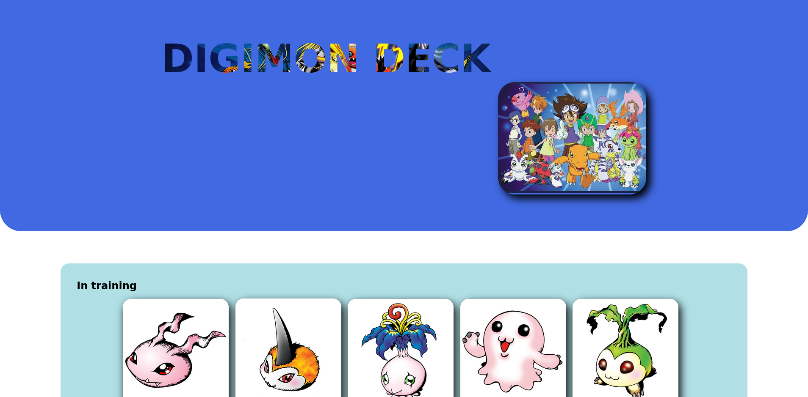
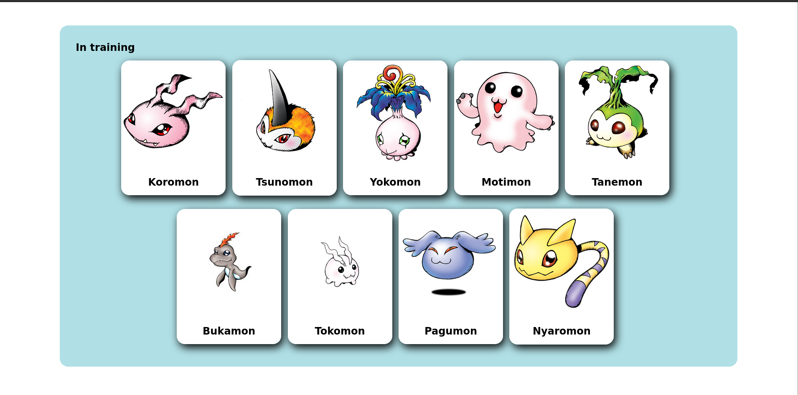
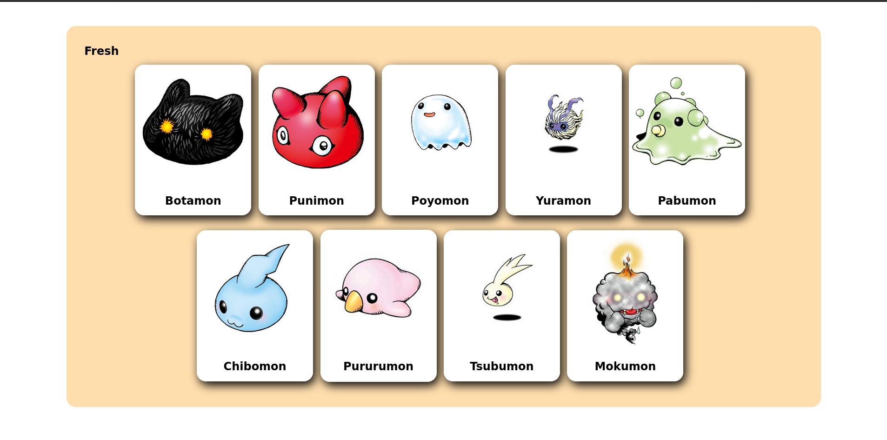
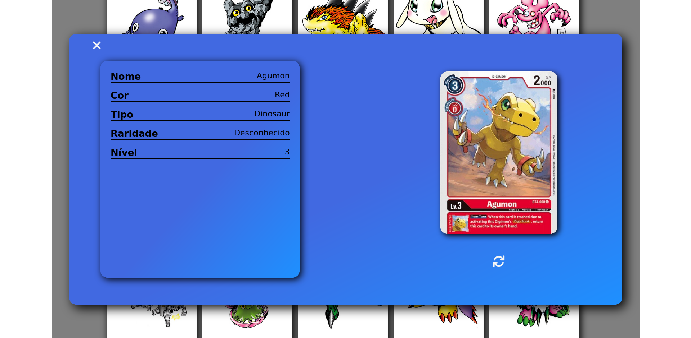
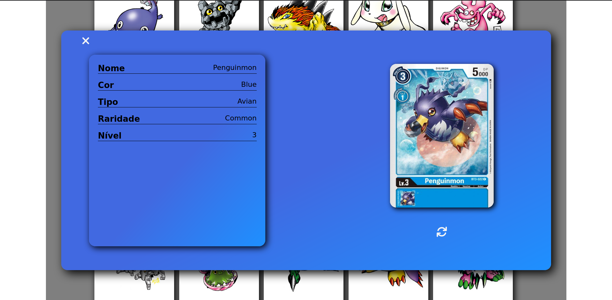
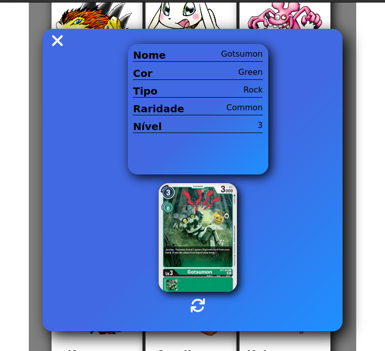

# Digimon Deck

- Utilizando JavaScript Assíncrono com o consumo de APIs.
- Estão sendo utilizadas as seguintes APIs:
    - <a href="https://digimon-api.vercel.app/">Digimon API</a>
    - <a href="https://documenter.getpostman.com/view/14059948/TzecB4fH">Digimon TCG API</a>

    
    
    
    
    
    

